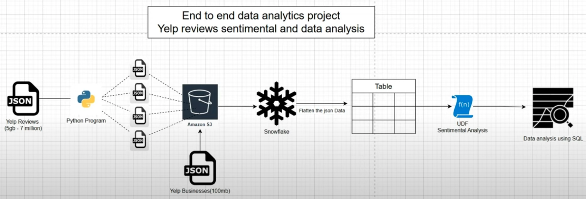

# 📊 Yelp Reviews Data Engineering & Sentiment Analysis Project

## 🧠 Overview

This is an end-to-end data engineering project that processes Yelp's large-scale review dataset using cloud-based technologies. The main goals are to:
- Ingest and process large JSON data files.
- Store and transform data in a Snowflake data warehouse.
- Perform sentiment analysis using a Python-based UDF.
- Derive meaningful business insights using SQL.

---

## 🧰 Tech Stack

- **Python**: Data preprocessing, file splitting.
- **AWS S3**: Storage for Yelp review and business data.
- **Snowflake**: Cloud data warehouse for data loading, transformation, and analysis.
- **SQL**: Data flattening and querying.
- **TextBlob**: Sentiment analysis in Python UDF.
- **Derive meaningful** business insights using SQL.

---

## 🗺️ Architecture



---

## 🚀 Pipeline Steps

### 1. Dataset Acquisition
- Downloaded the Yelp dataset from [Yelp Open Dataset](https://business.yelp.com/data/resources/open-dataset/).
- Focused on two files:
  - `yelp_academic_dataset_review.json` (~5GB, ~7 million records)
  - `yelp_academic_dataset_business.json` (~100MB)

### 2. File Preprocessing
- The 5GB review JSON file was split into ~20 smaller chunks (~250MB each) using a Python script.
- Due to upload limits and performance constraints, only **1 review split** and **1 business file** were used in the demo pipeline.

### 3. Upload to AWS S3
- Uploaded both JSON files to an AWS S3 bucket manually.
- Granted S3 access using AWS Access Key ID and Secret Key.

### 4. Load Data into Snowflake (without stage)
- Used Snowflake’s `COPY INTO` command directly (no named stage) to load JSON data:
```sql
    COPY INTO yelp_reviews_raw
    FROM 's3://your-bucket-name/review_split_01.json'
    CREDENTIALS = (
    AWS_KEY_ID = 'your_key'
    AWS_SECRET_KEY = 'your_secret'
    )
    FILE_FORMAT = (TYPE = 'JSON');

### 5. Analyze Data in SQL
- Performed various queries to extract business insights and sentiment trends.


---

## 📊 Example Analyses

- 1- find number of business in each category
- 2- find the top 10 users who have reviewed the most business in the "Resturants" category
- 3- find the most popular categories of businesses (based on the number of reviews)
- & more...

---

## 🔒 Note

Due to data size limits, only a sample (250MB) of the dataset is included for now.

---
